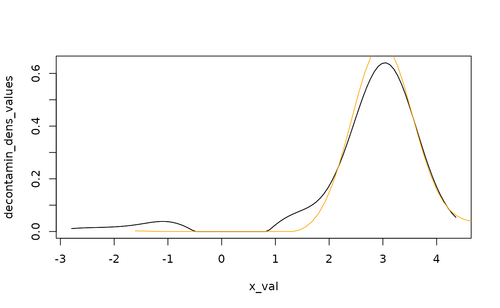

# Estimation of unknown elements in admixture models

``` r
library(admix)
```

We remind that a random variable $X$ following an admixture distribution
has cumulative distribution function (cdf) $L$ given by
$$L(x) = pF(x) + (1 - p)G(x),\qquad x \in {\mathbb{R}},$$ where $G$ is a
mixture component whose distribution is perfectly known, whereas $p$ and
$F$ are unknown. In this setting, if no parametric assumption is made on
the unknown component distribution $F$, the mixture is considered as a
semiparametric mixture. For an overview on semiparametric extensions of
finite mixture models, see (Xiang and Yang 2018).

## Estimation of the unknown component weight in an admixture model

The mixture weight $p$ of the unknown component distribution can be
estimated using diverse techniques depending on the assumptions made on
the unknown cdf $F$, among which the ones discussed in the sequel:

- the estimator provided by Bordes and Vandekerkhove, see (L. Bordes and
  Vandekerkhove 2010);
- the estimator provided by Patra and Sen, see (Patra and Sen 2016);
- the estimator provided by the Inversion - Best Matching method, see
  (Milhaud et al. 2024).

All these estimation methods can be performed using one single generic
function for estimation with appropriate arguments, the so-called
$admix\_ estim$ function.

### The one-sample case

Many works studied the estimation of the unknown proportion in
two-component admixture models. Among them, seminal papers are (Laurent
Bordes, Delmas, and Vandekerkhove 2006) and (S. Bordes L. Mottelet and
Vandekerkhove 2006). These papers are closely connected to the paper by
(L. Bordes and Vandekerkhove 2010), where an asymptotic normal estimator
is provided for the unknown component weight.

#### Case of symmetric unknown density

In this case, we use the Bordes and Vandekerkhove estimator, see (L.
Bordes and Vandekerkhove 2010).

``` r
## Simulate mixture data:
mixt1 <- twoComp_mixt(n = 400, weight = 0.7,
                      comp.dist = list("norm", "norm"),
                      comp.param = list(c("mean" = 3, "sd" = 0.5),
                                        c("mean" = 0, "sd" = 1)))
data1 <- get_mixture_data(mixt1)
## Define the admixture model:
admixMod <- admix_model(knownComp_dist = mixt1$comp.dist[[2]],
                        knownComp_param = mixt1$comp.param[[2]])
admix_estim(samples = list(data1), admixMod = list(admixMod), est_method = 'BVdk')
#> 
#> Call:admix_estim(samples = list(data1), admixMod = list(admixMod), 
#>     est_method = "BVdk")
#> 
#> ******** Sample #1 ********
#> Estimated mixing weight: 0.665 / Estimated location shift: 2.976
```

Because this estimation method relies on the symmetry of the unknown
component density, the estimator provides both the estimated mixing
weight of the unknown component distribution and the estimated location
shift parameter.

#### Other cases

In full generality (no assumptions made on the unknown component
distribution), we use the Patra and Sen estimator, see (Patra and Sen
2016).

``` r
admix_estim(samples = list(data1), admixMod = list(admixMod), est_method = 'PS')
#> 
#> Call:admix_estim(samples = list(data1), admixMod = list(admixMod), 
#>     est_method = "PS")
#> 
#> ******** Sample #1 ********
#>  Estimated mixing weight (of the unknown component): 0.641
#>  Selected c_n equals 0.179 in the penalization term. See ?estim_PS
```

In this case, the only estimated parameter is the mixing proportion
related to the unknown component distribution.

### The two-sample case

In the two-sample setting, one idea could be to use the Inversion - Best
Matching (IBM) approach. The IBM method ensures asymptotically normal
estimators of the unknown quantities, which will be very useful in a
testing perspective. However, it is important to note that such
estimators are mostly biased when $F_{1} \neq F_{2}$, and general
one-sample estimation strategies such as (Patra and Sen 2016) or (L.
Bordes and Vandekerkhove 2010) may be preferred to estimate the unknown
component proportion in general settings (despite that this is more
time-consuming). In the latter case, one performs twice the estimation
method, on each of the two samples under study.

#### Under the null hypothesis $H_{0}:F_{1} = F_{2}$

When we are under the null, Milhaud et al. (2024) show that the
estimators is consistent towards the true parameter values.

``` r
## Simulate mixture data:
mixt1 <- twoComp_mixt(n = 450, weight = 0.4,
                      comp.dist = list("norm", "norm"),
                      comp.param = list(list("mean" = -2, "sd" = 0.5),
                                        list("mean" = 0, "sd" = 1)))
mixt2 <- twoComp_mixt(n = 380, weight = 0.7,
                      comp.dist = list("norm", "norm"),
                      comp.param = list(list("mean" = -2, "sd" = 0.5),
                                        list("mean" = 1, "sd" = 1)))
data1 <- get_mixture_data(mixt1)
data2 <- get_mixture_data(mixt2)
## Define the admixture models:
admixMod1 <- admix_model(knownComp_dist = mixt1$comp.dist[[2]],
                         knownComp_param = mixt1$comp.param[[2]])
admixMod2 <- admix_model(knownComp_dist = mixt2$comp.dist[[2]],
                         knownComp_param = mixt2$comp.param[[2]])
admix_estim(samples = list(data1, data2), admixMod = list(admixMod1, admixMod2),
            est_method = 'IBM')
#> 
#> Call:admix_estim(samples = list(data1, data2), admixMod = list(admixMod1, 
#>     admixMod2), est_method = "IBM")
#> 
#> Pairwise estimation performed (IBM estimation method).
#> 
#> ******** Samples #1 with #2 ********
#> Estimated mixing weight of the unknown distribution in the 1st sample: 0.409 
#> Estimated mixing weight of the unknown distribution in the 2nd sample: 0.725
```

Indeed, one can see that the two unknown proportions were consistently
estimated.

#### Under the alternative hypothesis $H_{1}:F_{1} \neq F_{2}$

Estimators are also consistent under $H_{1}$, although they can be
(strongly) biased as compared to their true values as illustrated in the
following example.

``` r
## Simulate mixture data:
mixt1 <- twoComp_mixt(n = 800, weight = 0.5,
                      comp.dist = list("norm", "norm"),
                      comp.param = list(list("mean" = 1, "sd" = 0.5),
                                        list("mean" = 0, "sd" = 1)))
mixt2 <- twoComp_mixt(n = 600, weight = 0.7,
                      comp.dist = list("norm", "norm"),
                      comp.param = list(list("mean" = 3, "sd" = 0.5),
                                        list("mean" = 5, "sd" = 2)))
data1 <- get_mixture_data(mixt1)
data2 <- get_mixture_data(mixt2)
## Define the admixture models:
admixMod1 <- admix_model(knownComp_dist = mixt1$comp.dist[[2]],
                         knownComp_param = mixt1$comp.param[[2]])
admixMod2 <- admix_model(knownComp_dist = mixt2$comp.dist[[2]],
                         knownComp_param = mixt2$comp.param[[2]])
## Estimate the mixture weights of the two admixture models (provide only hat(theta)_n):
admix_estim(samples = list(data1, data2), admixMod = list(admixMod1, admixMod2),
            est_method = 'IBM')
#> 
#> Call:admix_estim(samples = list(data1, data2), admixMod = list(admixMod1, 
#>     admixMod2), est_method = "IBM")
#> 
#> Pairwise estimation performed (IBM estimation method).
#> 
#> ******** Samples #1 with #2 ********
#> Estimated mixing weight of the unknown distribution in the 1st sample: 0.332 
#> Estimated mixing weight of the unknown distribution in the 2nd sample: 0.655
```

In such a framework, it is therefore better to use the estimator by
(Patra and Sen 2016), which shows better performance:

``` r
admix_estim(samples = list(data1, data2), admixMod = list(admixMod1, admixMod2),
            est_method = 'PS')
#> 
#> Call:admix_estim(samples = list(data1, data2), admixMod = list(admixMod1, 
#>     admixMod2), est_method = "PS")
#> 
#> ******** Sample #1 ********
#>  Estimated mixing weight (of the unknown component): 0.45
#>  Selected c_n equals 0.19 in the penalization term. See ?estim_PS
#> 
#> ******** Sample #2 ********
#>  Estimated mixing weight (of the unknown component): 0.727
#>  Selected c_n equals 0.186 in the penalization term. See ?estim_PS
```

## Estimation of the unknown cumulative distribution function

Concerning the unknown cdf $F$, one usually estimate it thanks to the
inversion formula $$F(x) = \frac{L(x) - (1 - p)G(x)}{p},$$ once $p$ has
been consistenly estimated.

This is what is commonly called the decontaminated density of the
unknown component. In the following, we propose to compare the two
decontaminated densities obtained once the unknown quantities have been
consistently estimated by the IBM approach. Note that we are under the
null ($F_{1} = F_{2}$), and thus that the decontaminated densities
should look similar.

``` r
## Simulate mixture data:
mixt1 <- twoComp_mixt(n = 800, weight = 0.4,
                      comp.dist = list("norm", "norm"),
                      comp.param = list(list("mean" = 3, "sd" = 0.5),
                                        list("mean" = 0, "sd" = 1)))
mixt2 <- twoComp_mixt(n = 700, weight = 0.6,
                      comp.dist = list("norm", "norm"),
                      comp.param = list(list("mean" = 3, "sd" = 0.5),
                                        list("mean" = 5, "sd" = 2)))
data1 <- get_mixture_data(mixt1)
data2 <- get_mixture_data(mixt2)
## Define the admixture models:
admixMod1 <- admix_model(knownComp_dist = mixt1$comp.dist[[2]],
                         knownComp_param = mixt1$comp.param[[2]])
admixMod2 <- admix_model(knownComp_dist = mixt2$comp.dist[[2]],
                         knownComp_param = mixt2$comp.param[[2]])
## Estimation:
est <- admix_estim(samples = list(data1,data2), admixMod = list(admixMod1,admixMod2),
                   est_method = 'PS')
prop <- get_mixing_weights(est)
## Determine the decontaminated version of the unknown density by inversion:
res1 <- decontaminated_density(sample1 = data1, estim.p = prop[1], admixMod = admixMod1)
res2 <- decontaminated_density(sample1 = data2, estim.p = prop[2], admixMod = admixMod2)
## Plot results:
plot(x = res1)
plot(x = res2, add_plot = TRUE, col = "orange")
```



## References

Bordes, Laurent, Céline Delmas, and Pierre Vandekerkhove. 2006.
“Semiparametric Estimation of a Two-Component Mixture Model Where One
Component Is Known.” *Scandinavian Journal of Statistics* 33 (4):
733–52. <http://www.jstor.org/stable/4616955>.

Bordes, L., and P. Vandekerkhove. 2010. “Semiparametric Two-Component
Mixture Model with a Known Component: An Asymptotically Normal
Estimator.” *Mathematical Methods of Statistics* 19 (1): 22–41.
https://doi.org/<https://doi.org/10.3103/S1066530710010023>.

Bordes, S., L. Mottelet, and P. Vandekerkhove. 2006. “Semiparametric
Estimation of a Two Components Mixture Model.” *Annals of Statistics*
34: 1204–32.

Milhaud, Xavier, Denys Pommeret, Yahia Salhi, and Pierre Vandekerkhove.
2024. “Two-sample contamination model test.” *Bernoulli* 30 (1): 170–97.
<https://doi.org/10.3150/23-BEJ1593>.

Patra, Rohit Kumar, and Bodhisattva Sen. 2016. “Estimation of a
two-component mixture model with applications to multiple testing.”
*Journal of the Royal Statistical Society Series B* 78 (4): 869–93.

Xiang, Yao, S., and G. Yang. 2018. “An Overview of Semiparametric
Extensions of Finite Mixture Models.” *Statistica Scinica* 34: 391–404.
